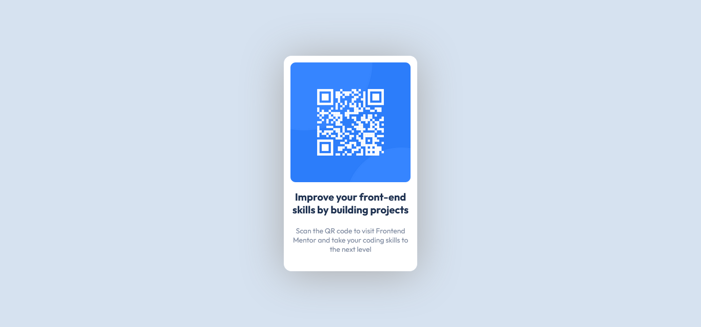

# Frontend Mentor - QR code component solution

This is a solution to the [QR code component challenge on Frontend Mentor](https://www.frontendmentor.io/challenges/card-component-iux_sIO_H). Frontend Mentor challenges help you improve your coding skills by building realistic projects. 

## Table of contents

- [Overview](#overview)
  - [Screenshot](#screenshot)
  - [Links](#links)
- [My process](#my-process)
  - [Built with](#built-with)
  - [Useful resources](#useful-resources)
- [Author](#author)

## Overview

### Screenshot

### Links

- Solution URL: (https://your-solution-url.com)
- Live Site URL: (https://claufss.github.io/qr-code-component)

## My process

### Built with

- Flexbox

### Useful resources

- [Origamid - Guia do Flexbox](https://origamid.com/projetos/flexbox-guia-completo) - This is an amazing article which helped me finally understand flexbox. I'd recommend it to anyone still learning this concept.

## Author

- Frontend Mentor - [@ClaufSS](https://www.frontendmentor.io/profile/ClaufSS)
- Github - [claufSS](https://github.com/claufss)
